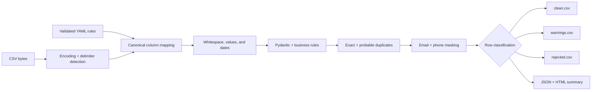
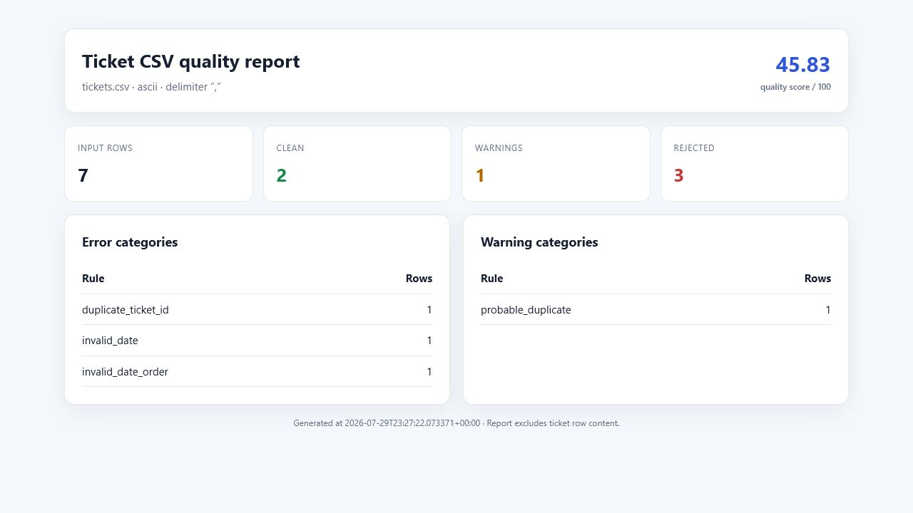

# Ticket CSV Cleaner

[](https://github.com/German4341374/ticket-csv-cleaner/actions/workflows/ci.yml)
[](https://www.python.org/)
[](LICENSE)

`ticket-csv-cleaner` is a typed CLI that validates and cleans Service Desk CSV exports before they are imported into another system. It detects common file-format differences, normalizes ticket data, separates records that need review, masks personal data, and creates audit-friendly HTML and JSON quality reports.

Processing is completely local. The application does not send ticket data to an external service.

## Problem

Service Desk exports frequently contain mixed encodings, inconsistent delimiters, renamed columns, ambiguous dates, duplicate ticket IDs, whitespace artifacts, and values that do not match the target system. Importing them directly can create duplicate incidents, fail a migration, or expose unnecessary personal data.

This project turns that manual spreadsheet cleanup into a repeatable pipeline with deterministic rules and machine-readable results.

## Features

- Detects character encoding with `charset-normalizer`.
- Detects comma, semicolon, tab, or pipe delimiters.
- Maps vendor-specific headers to nine canonical fields through YAML.
- Removes completely empty records.
- Trims whitespace, collapses repeated spaces, and normalizes line endings.
- Normalizes configurable status and priority aliases.
- Parses multiple configured date formats with a `python-dateutil` fallback.
- Rejects resolutions earlier than ticket creation.
- Rejects repeated `ticket_id` values.
- Flags probable duplicates using normalized title similarity for the same requester.
- Validates configurable required fields and requester email syntax.
- Masks email addresses and phone numbers by default.
- Produces mutually exclusive `clean.csv`, `warnings.csv`, and `rejected.csv` files.
- Generates aggregate-only JSON and standalone HTML reports.
- Supports dry runs and masked terminal previews.
- Uses distinct exit codes for automation.

## Canonical columns

Every input must provide these columns directly or through `column_mapping`:

| Column | Meaning |
| --- | --- |
| `ticket_id` | Source ticket identifier |
| `title` | Short ticket summary |
| `description` | Full description |
| `status` | Workflow state |
| `priority` | Business priority |
| `requester_email` | Requester address |
| `assignee` | Current owner |
| `created_at` | Creation timestamp |
| `resolved_at` | Optional resolution timestamp |

Additional source columns are ignored. Multiple source columns cannot map to the same canonical name.

## Architecture



Detection, normalization, validation, masking, classification, and reporting are separate modules. CLI commands orchestrate those modules but do not contain transformation rules. See [architecture details](docs/architecture.md).

## Installation

### uv

Requirements:

- Python 3.12, 3.13, or 3.14
- [uv](https://docs.astral.sh/uv/) 0.11.7 or compatible

```bash
git clone https://github.com/German4341374/ticket-csv-cleaner.git
cd ticket-csv-cleaner
uv sync --frozen --extra dev
uv run ticket-csv-cleaner --help
```

### pip

```bash
python -m venv .venv
source .venv/bin/activate
python -m pip install --editable ".[dev]"
ticket-csv-cleaner --help
```

PowerShell activation:

```powershell
python -m venv .venv
.\.venv\Scripts\Activate.ps1
python -m pip install --editable ".[dev]"
```

All runtime and development versions are locked in `uv.lock`.

## Commands

Validate without writing files:

```bash
ticket-csv-cleaner validate tickets.csv
ticket-csv-cleaner validate tickets.csv --config rules.yaml
```

Clean and write all outputs:

```bash
ticket-csv-cleaner clean tickets.csv --config rules.yaml
ticket-csv-cleaner clean tickets.csv --output-dir migration-output
```

Perform the complete analysis without modifying the filesystem:

```bash
ticket-csv-cleaner clean tickets.csv --config rules.yaml --dry-run
```

Preview up to 20 masked, normalized rows:

```bash
ticket-csv-cleaner preview tickets.csv --rows 20
ticket-csv-cleaner preview tickets.csv --config rules.yaml --rows 20
```

Exit codes:

| Code | Meaning |
| ---: | --- |
| `0` | Processing completed with no rejected rows |
| `1` | Processing completed, but at least one row was rejected |
| `2` | Input, configuration, or output operation failed |

The `clean` command still writes review outputs before returning code `1`.

## Configuration

```yaml
column_mapping:
  Ticket Number: ticket_id
  Subject: title
  Details: description
  State: status
  Severity: priority
  Requester: requester_email
  Owner: assignee
  Created: created_at
  Resolved: resolved_at

status_mapping:
  new: Open
  open: Open
  working: In Progress
  pending: In Progress
  solved: Resolved
  closed: Closed

priority_mapping:
  p4: Low
  p3: Medium
  p2: High
  p1: Critical

required_fields:
  - ticket_id
  - title
  - status
  - priority
  - requester_email
  - created_at

date_formats:
  - "%Y-%m-%dT%H:%M:%S%z"
  - "%Y-%m-%d %H:%M:%S"
  - "%d.%m.%Y %H:%M"

day_first: false
mask_personal_data: true
probable_duplicate_threshold: 0.88
```

Configuration is validated by Pydantic with unknown keys forbidden. Header matching is case-insensitive. Status and priority matching is case-insensitive after whitespace normalization.

The complete runnable example is [examples/rules.yaml](examples/rules.yaml). See [data-quality rules](docs/data-quality-rules.md) for classification details.

## Before and after

Input:

```csv
ticket_id,title,description,status,priority,requester_email,assignee,created_at,resolved_at
INC-1001,  VPN   timeout  ,"Call +1 202 555 0147",new,p2,alex@example.test,Sam,2026-07-20 08:15:00,
```

`clean.csv`:

```csv
ticket_id,title,description,status,priority,requester_email,assignee,created_at,resolved_at
INC-1001,VPN timeout,[PHONE-***47],Open,High,a***@e***.test,Sam,2026-07-20T08:15:00,
```

Masking happens after validation and duplicate comparison, so normalized email values remain useful for matching without being written unmasked.

## Output files

| File | Contents |
| --- | --- |
| `clean.csv` | Valid rows without warnings |
| `warnings.csv` | Valid rows requiring review, plus `_line_number` and `_issues` |
| `rejected.csv` | Invalid rows, plus `_line_number` and `_issues` |
| `report.json` | Detected format and aggregate quality metrics |
| `report.html` | Standalone visual aggregate report |

The three CSV classifications are mutually exclusive. Reports do not include titles, descriptions, requester addresses, or other ticket row content.

The quality score gives clean rows full weight, warning rows 75% weight, and rejected rows zero weight:

```text
(clean rows + warning rows × 0.75) / non-empty rows × 100
```

## HTML report

The following screenshot was captured from the report produced by the included demonstration data:



The report is standalone HTML with embedded CSS and no scripts, remote assets, or network calls.

## Demonstration

The demo intentionally contains a probable duplicate, an exact duplicate, an invalid date, an invalid date order, and an empty row:

```bash
uv run ticket-csv-cleaner preview examples/tickets.csv --config examples/rules.yaml --rows 3
uv run ticket-csv-cleaner clean examples/tickets.csv \
  --config examples/rules.yaml \
  --output-dir output
```

Expected summary:

```text
Input rows: 7
Empty rows removed: 1
Clean rows: 2
Warning rows: 1
Rejected rows: 3
Exact duplicates: 1
Probable duplicates: 1
Quality score: 45.83/100
```

The second command intentionally returns exit code `1` after writing all five files.

## Docker

The multi-stage image is pinned, contains only runtime dependencies, and runs as UID/GID `10001`.

```bash
docker build --tag ticket-csv-cleaner:local .
docker run --rm ticket-csv-cleaner:local --version
```

Read-only validation:

```bash
docker run --rm \
  --volume "$PWD:/work:ro" \
  ticket-csv-cleaner:local \
  validate /work/tickets.csv --config /work/rules.yaml
```

For writable output on Linux, run with the current non-root host identity:

```bash
mkdir -p output
docker run --rm \
  --user "$(id -u):$(id -g)" \
  --volume "$PWD:/work" \
  ticket-csv-cleaner:local \
  clean /work/tickets.csv --config /work/rules.yaml --output-dir /work/output
```

Docker Desktop supports the same bind-mount paths through WSL2.

## Development and tests

```bash
make setup
make lint
make typecheck
make test
make coverage
make build
make docker-build
```

Equivalent direct commands:

```bash
uv run ruff format --check .
uv run ruff check .
uv run mypy src tests
uv run pytest -q
uv run pytest -q --cov=ticket_csv_cleaner --cov-report=term-missing
uv build --no-sources
```

The suite includes more than 25 tests and covers:

- valid, missing-column, malformed-date, duplicate, semicolon, CP1251, and UTF-16 fixtures;
- encoding and delimiter detection;
- configurable column mappings;
- status, priority, whitespace, line-ending, and date normalization;
- chronology, required-field, email, and duplicate rules;
- masking, dry run, preview, output files, reports, and CLI exit codes.

GitHub Actions runs Ruff, strict mypy, coverage, package builds, Python 3.12–3.14 compatibility tests, and a non-root Docker smoke test. Workflow permissions are read-only.

## Security and privacy

- No network request is made during CSV processing.
- Source files are never modified.
- Output writes use temporary files followed by atomic replacement.
- Email and phone masking is enabled by default.
- Reports exclude row-level ticket content.
- All committed fixtures use invented `.test` addresses and fictional data.

Masking is not a complete data-loss-prevention system. Always review output before sharing it and keep Service Desk exports in access-controlled storage. See [SECURITY.md](SECURITY.md).

## Troubleshooting

### Missing expected columns

Add every absent source-to-canonical pair to `column_mapping`. The error lists unresolved canonical names.

### Unexpected date interpretation

Place the exact vendor format first in `date_formats`. Set `day_first` explicitly for ambiguous numeric dates.

### Too many probable duplicates

Increase `probable_duplicate_threshold` toward `1.0`. Exact `ticket_id` duplicate detection is unaffected.

### Wrong delimiter or encoding

Inspect the detected values with `preview`. If a file is severely malformed, export it again as a consistent CSV instead of manually editing a production copy.

Additional recovery guidance is in the [operations runbook](docs/runbook.md).

## Limitations

- CSV only; XLSX and API sources are outside the project scope.
- Encoding and delimiter detection are heuristic for unusual or very small files.
- Required columns must exist in the header even when some row values are optional.
- Probable duplicate matching compares titles only within the same requester and is quadratic for large requester groups.
- Dates without timezone information remain timezone-naive.
- The phone and email patterns cannot identify every possible personal-data format.
- Processing is in memory and is intended for small and medium Service Desk exports, not multi-gigabyte data lakes.

## License

[MIT](LICENSE)
